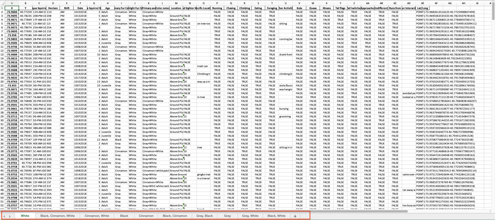

# Export data into separate excel sheets

## Introduction

This code can export specific column of `.csv` file into separate sheets in `.xlsx` file based on simple Python code.

## Required Python packages

* pandas

```shell
$ pip install pandas
```

* openpyxl

```shell
$ pip install openpyxl
```

## Usage

```Python
SOURCE_FILE_NAME = "2018_Central_Park_Squirrel_Census_-_Squirrel_Data.csv"
SAVE_FILE_NAME = 'example'
TARGET_COLUMN = 'Highlight Fur Color'
TARGET_DATATYPE = str
```

This example uses data from [NYC OpenData][NYC-opendata], which counts squirrels in New York's Central Park.

* `SOURCE_FILE_NAME` : The .csv file you want to use.
* `SAVE_FILE_NAME`: The excel file name that you want.
* `TARGET_COLUMN`: The data you want to export into new excel file as sheets.Here we use Squirrel's Highlight Fur Color as the target.
* `TARGET_DATATYPE`: Specifying the data type of target column.  

## Result of example



[NYC-OpenData]: <https://data.cityofnewyork.us/Environment/2018-Central-Park-Squirrel-Census-Squirrel-Data/vfnx-vebw>
